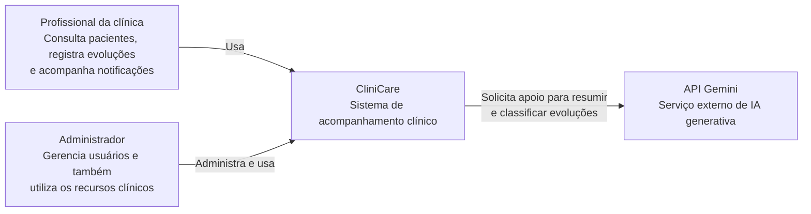
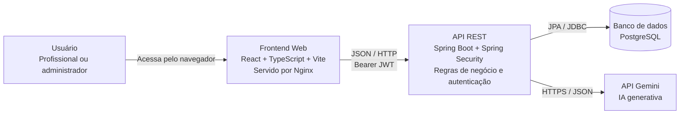
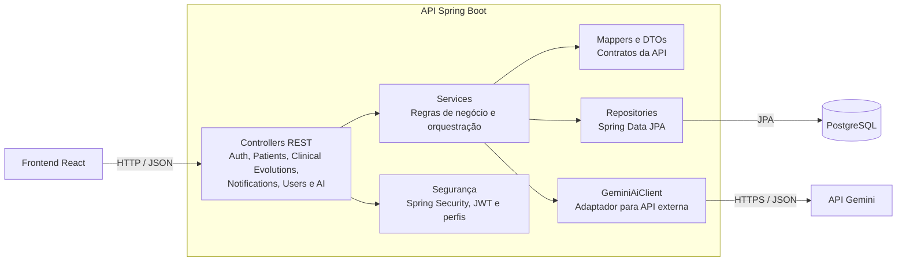

# CliniCare

Sistema web para acompanhamento clínico de pacientes, registro de evoluções e
gerenciamento de notificações. O projeto foi desenvolvido como uma aplicação
full stack com frontend React, API REST em Spring Boot e persistência em
PostgreSQL.

## Funcionalidades

- Cadastro, listagem e consulta de pacientes.
- Registro e histórico de evoluções clínicas por paciente.
- Classificação das evoluções por nível de atenção.
- Criação assíncrona de notificações ao registrar uma evolução.
- Listagem e marcação de notificações como lidas.
- Cadastro de usuários com acesso restrito ao perfil administrador.
- Interface com dashboard, pacientes, notificações, usuários e perfil.
- Autenticação JWT com autorização por perfil e senhas criptografadas.
- Geração opcional de resumo clínico e sugestão de atenção com IA.

## Tecnologias

| Camada | Tecnologias |
| --- | --- |
| Frontend | React 19, TypeScript, Vite, React Router, Axios, Sass |
| Backend | Java 21, Spring Boot 4, Spring Web MVC, Spring Data JPA, Spring Security |
| Banco de dados | PostgreSQL |
| Infraestrutura local | Docker, Docker Compose, Nginx |
| Integração externa | API Gemini para apoio à análise de evoluções clínicas |

## Arquitetura

A documentação abaixo utiliza o **C4 Model** em três níveis: contexto,
contêineres e componentes. Os diagramas foram escritos em Mermaid para que
possam ser visualizados diretamente no GitHub.

### Nível 1: Contexto

O CliniCare centraliza o acompanhamento de pacientes por profissionais da
clínica. Administradores também gerenciam os usuários que acessam o sistema.



### Nível 2: Contêineres



### Nível 3: Componentes do Backend



### Fluxo de uma evolução clínica

1. O profissional abre os detalhes de um paciente e registra uma evolução.
2. O frontend envia os dados para `POST /clinical-evolutions`.
3. O backend valida o paciente e, quando informado, o profissional responsável.
4. A evolução é persistida no PostgreSQL.
5. Uma notificação é criada de forma assíncrona, com prioridade alta quando a
   evolução possui nível de atenção `HIGH`.
6. Opcionalmente, o profissional solicita à IA um resumo e uma sugestão de
   nível de atenção antes de salvar a evolução.

## Padrões Aplicados

O backend segue uma arquitetura em camadas:

| Camada | Responsabilidade |
| --- | --- |
| Controller | Receber requisições HTTP e devolver respostas padronizadas |
| Service | Concentrar regras de negócio e coordenar os casos de uso |
| Repository | Isolar a persistência com Spring Data JPA |
| Mapper | Converter entidades em DTOs e evitar exposição direta do modelo |

Também foi aplicado o padrão **Adapter** na integração com IA. A interface
`AiClient` define o contrato usado pelo serviço clínico, enquanto
`GeminiAiClient` encapsula os detalhes da API Gemini. Dessa forma, a regra de
negócio não depende diretamente do provedor externo e pode receber outra
implementação no futuro.

## Decisões Técnicas

- **PostgreSQL como banco relacional:** os dados clínicos possuem relações
  claras entre pacientes, profissionais, evoluções e notificações.
- **DTOs na API:** os contratos HTTP ficam separados das entidades JPA e não
  expõem campos sensíveis, como senha.
- **Exclusão lógica:** as entidades possuem o campo `active`, preservando o
  histórico em vez de remover registros imediatamente.
- **Notificações assíncronas:** `@Async` permite criar a notificação após uma
  evolução sem manter a requisição principal aguardando essa persistência.
- **Docker Compose:** simplifica a execução coordenada de frontend, backend e
  PostgreSQL no ambiente local.
- **Mermaid para os diagramas C4:** mantém a documentação versionada junto ao
  código e renderizável diretamente no GitHub.

## Estrutura do Repositório

```text
.
├── backend/             # API REST Spring Boot
├── frontend/            # SPA React servida por Nginx em produção
├── .env.example         # Variáveis configuráveis do ambiente Docker
├── docker-compose.yml   # PostgreSQL, backend e frontend
└── README.md
```

## Como Executar

### Pré-requisitos

- Docker e Docker Compose; ou
- Java 21, Node.js 22+, npm e PostgreSQL para execução manual.

### Com Docker Compose

Crie o arquivo de ambiente e ajuste os valores sensíveis:

```bash
cp .env.example .env
```

Preencha `AI_API_KEY` para habilitar a geração de resumos com Gemini. Em
seguida, suba os três contêineres da aplicação:

```bash
docker compose up --build
```

Após a inicialização:

- Frontend: `http://localhost:3000`
- Backend: `http://localhost:8080`
- PostgreSQL: `localhost:5435`

O Nginx encaminha requisições `/api` para o backend. Em um banco novo, o
bootstrap cria o administrador definido no arquivo `.env`.

Credenciais padrão para ambiente local:

- E-mail: `admin@clinicare.local`
- Senha: `change-me` ao usar `.env.example`, ou `admin123` sem arquivo `.env`

> [!WARNING]
> Troque o segredo JWT e a senha inicial antes de publicar a aplicação.

### Execução Manual

Crie o arquivo local de propriedades do backend:

```bash
cp backend/src/main/resources/application.properties.template \
  backend/src/main/resources/application.properties
```

Complete o arquivo com a conexão PostgreSQL, um segredo JWT com tamanho
adequado para HS256 e, para testar a integração de IA, a chave e a URL da API
Gemini. O arquivo `application.properties` é ignorado pelo Git e não deve ser
versionado.

Suba o backend:

```bash
cd backend
./mvnw spring-boot:run
```

Em outro terminal, suba o frontend:

```bash
cd frontend
npm install
npm run dev
```

No modo de desenvolvimento, acesse `http://localhost:5173`.

## API REST

Todas as respostas seguem a estrutura:

```json
{
  "success": true,
  "message": "Descrição do resultado.",
  "data": {},
  "error": null
}
```

Principais endpoints:

| Método | Endpoint | Descrição |
| --- | --- | --- |
| `POST` | `/auth/login` | Autentica um usuário |
| `GET`, `POST` | `/patients` | Lista e cadastra pacientes |
| `GET`, `PUT`, `DELETE` | `/patients/{id}` | Consulta, atualiza e remove logicamente um paciente |
| `GET` | `/patients/filter/status` | Filtra pacientes por status |
| `GET` | `/patients/filter/name` | Busca pacientes por nome |
| `GET`, `POST` | `/clinical-evolutions` | Lista e registra evoluções |
| `GET` | `/clinical-evolutions/patient/{patientId}` | Lista evoluções de um paciente |
| `GET` | `/clinical-evolutions/professional/{professionalId}` | Lista evoluções de um profissional |
| `GET` | `/notifications` | Lista notificações |
| `GET` | `/notifications/unread` | Lista notificações não lidas |
| `PATCH` | `/notifications/{id}/read` | Marca uma notificação como lida |
| `GET`, `POST` | `/users` | Lista e cadastra usuários administrativamente |
| `POST` | `/ai/clinical-evolution/analyze` | Gera resumo e sugestão de atenção com IA |

## Validação

Frontend:

```bash
cd frontend
npm run lint
npm run build
```

Backend:

```bash
cd backend
./mvnw test
```

## Aderência ao Desafio

| Requisito | Estado | Observação |
| --- | --- | --- |
| Cadastro e listagem de pacientes | Concluído | Disponível no frontend e no backend |
| Edição de pacientes | Concluído | Disponível na listagem e nos detalhes |
| Cadastro de evoluções clínicas | Concluído | Disponível nos detalhes do paciente |
| Visualização do histórico clínico | Concluído | Disponível nos detalhes do paciente |
| Notificações assíncronas | Concluído | Implementadas com `@Async` |
| API REST, React e PostgreSQL | Concluído | Estrutura full stack implementada |
| Docker Compose | Concluído | Variáveis configuráveis e proxy Nginx incluídos |
| Aplicação publicada na internet | Pendente | É necessário publicar e adicionar o link |
| README com documentação | Concluído | Instruções, arquitetura, decisões e melhorias documentadas |
| Integração com LLM | Concluído | Endpoint Gemini conectado ao formulário de evolução |
| Documentação C4 Model | Concluído | Contexto, contêineres e componentes documentados |

## Pendência para Entrega

- Publicar a aplicação na internet e adicionar o endereço ao README.

## Melhorias Futuras

- Adicionar testes do frontend e uma automação de CI.
- Aumentar a cobertura de testes de integração dos endpoints REST.
- Adicionar paginação controlada pela interface para bases maiores.
