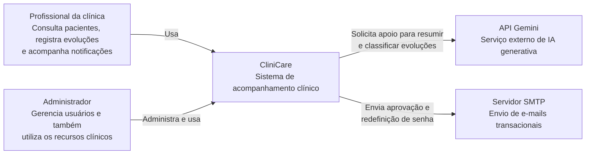
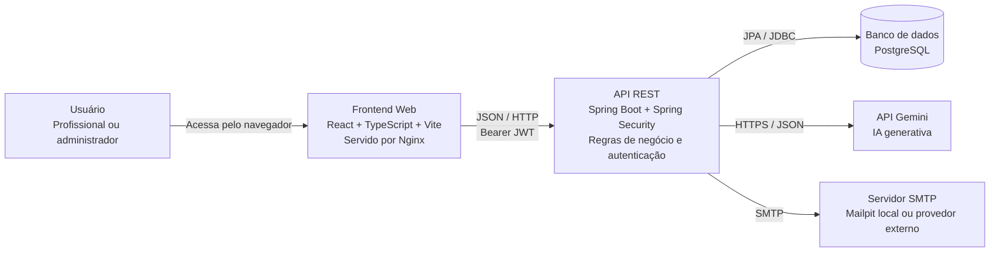
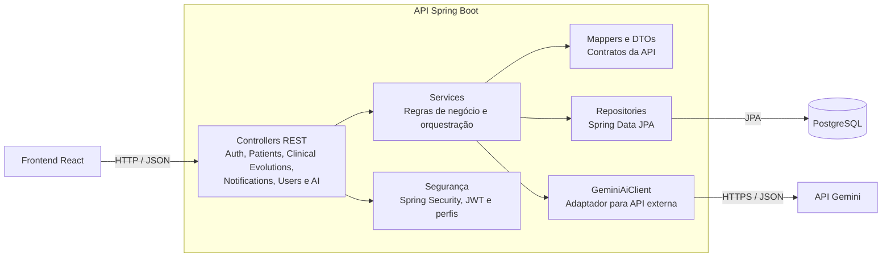

# CliniCare

Sistema web para acompanhamento clínico de pacientes, registro de evoluções e
gerenciamento de notificações. O projeto foi desenvolvido como uma aplicação
full stack com frontend React, API REST em Spring Boot e persistência em
PostgreSQL.

## Funcionalidades

- Cadastro, listagem e consulta de pacientes.
- Paginação server-side nas listagens de pacientes, usuários, notificações e histórico clínico.
- Registro e histórico de evoluções clínicas por paciente.
- Classificação das evoluções por nível de atenção.
- Criação assíncrona de notificações ao registrar uma evolução.
- Listagem e marcação de notificações como lidas.
- Registro público de profissionais com aprovação pelo administrador.
- Recuperação de senha por token temporário enviado por e-mail.
- Aprovação ou recusa de contas diretamente na listagem de usuários.
- Interface com dashboard, pacientes, notificações, usuários e perfil.
- Autenticação JWT com autorização por perfil e senhas criptografadas.
- Geração opcional de resumo clínico e sugestão de atenção com IA.
- Geração assistida de resumo geral do histórico de um paciente com Gemini.

## Tecnologias

| Camada               | Tecnologias                                                              |
| -------------------- | ------------------------------------------------------------------------ |
| Frontend             | React 19, TypeScript, Vite, React Router, Axios, Sass                    |
| Backend              | Java 21, Spring Boot 4, Spring Web MVC, Spring Data JPA, Spring Security |
| Banco de dados       | PostgreSQL                                                               |
| Infraestrutura local | Docker, Docker Compose, Nginx, Mailpit                                   |
| Integração externa   | API Gemini para apoio à análise de evoluções clínicas                    |

## Deploy

- Repositório: [https://github.com/C-Fernandes/CliniCare](https://github.com/C-Fernandes/CliniCare)
- Aplicação publicada: [https://clini-care-ruddy.vercel.app/](https://clini-care-ruddy.vercel.app/)

O deploy permite acessar a interface publicada na internet. O envio de e-mails
transacionais, como aprovação de conta e recuperação de senha, não está
habilitado no ambiente publicado porque depende de um remetente/domínio
verificado e de um provedor de e-mail compatível com a infraestrutura de
deploy. No plano gratuito do Render, conexões SMTP de saída nas portas comuns
`25`, `465` e `587` podem ser bloqueadas para reduzir abuso e envio de spam em
infraestrutura compartilhada. Por isso, o fluxo de e-mail funciona no ambiente
local com Mailpit, mas não deve ser considerado disponível no deploy atual.

## Arquitetura

A documentação abaixo utiliza o **C4 Model** em três níveis: contexto,
contêineres e componentes. Os diagramas foram escritos em Mermaid para que
possam ser visualizados diretamente no GitHub.

### Nível 1: Contexto

O CliniCare centraliza o acompanhamento de pacientes por profissionais da
clínica. Administradores também gerenciam os usuários que acessam o sistema.



### Nível 2: Contêineres



### Nível 3: Componentes do Backend



### Fluxo de uma evolução clínica

1. O profissional abre os detalhes de um paciente e registra uma evolução.
2. O frontend envia os dados para `POST /clinical-evolutions`.
3. O backend valida o paciente e, quando informado, o profissional responsável.
4. A evolução é persistida no PostgreSQL.
5. Uma notificação é criada de forma assíncrona, com prioridade alta quando a
   evolução possui nível de atenção `HIGH`.
6. Opcionalmente, o profissional solicita à IA um resumo e uma sugestão de
   nível de atenção antes de salvar a evolução.

## Padrões Aplicados

O backend segue uma arquitetura em camadas:

| Camada     | Responsabilidade                                                |
| ---------- | --------------------------------------------------------------- |
| Controller | Receber requisições HTTP e devolver respostas padronizadas      |
| Service    | Concentrar regras de negócio e coordenar os casos de uso        |
| Repository | Isolar a persistência com Spring Data JPA                       |
| Mapper     | Converter entidades em DTOs e evitar exposição direta do modelo |

Também foi aplicado o padrão **Adapter** na integração com IA. A interface
`AiClient` define o contrato usado pelo serviço clínico, enquanto
`GeminiAiClient` encapsula os detalhes da API Gemini. Dessa forma, a regra de
negócio não depende diretamente do provedor externo e pode receber outra
implementação no futuro.

## Decisões Técnicas

- **PostgreSQL como banco relacional:** os dados clínicos possuem relações
  claras entre pacientes, profissionais, evoluções e notificações.
- **DTOs na API:** os contratos HTTP ficam separados das entidades JPA e não
  expõem campos sensíveis, como senha.
- **Exclusão lógica:** as entidades possuem o campo `active`, preservando o
  histórico em vez de remover registros imediatamente.
- **Notificações assíncronas:** `@Async` permite criar a notificação após uma
  evolução sem manter a requisição principal aguardando essa persistência.
- **Docker Compose:** simplifica a execução coordenada de frontend, backend,
  PostgreSQL e Mailpit no ambiente local.
- **Mermaid para os diagramas C4:** mantém a documentação versionada junto ao
  código e renderizável diretamente no GitHub.

## Estrutura do Repositório

```text
.
├── backend/             # API REST Spring Boot
├── frontend/            # SPA React servida por Nginx em produção
├── .env.example         # Variáveis configuráveis do ambiente Docker
├── docker-compose.yml   # PostgreSQL, backend, frontend e Mailpit
└── README.md
```

## Como Executar

### Pré-requisitos

- Docker e Docker Compose; ou
- Java 21, Node.js 22+, npm e PostgreSQL para execução manual.

### Com Docker Compose

Crie o arquivo de ambiente e ajuste os valores sensíveis:

```bash
cp .env.example .env
```

Preencha `GEMINI_API_KEY` para habilitar a geração de resumos com Gemini. Em
seguida, suba os contêineres da aplicação:

```bash
docker compose up --build
```

Após a inicialização:

- Frontend: `http://localhost:3000`
- Backend: `http://localhost:8080`
- PostgreSQL: `localhost:5435`
- Caixa de e-mails local (Mailpit): `http://localhost:8025`

O Nginx encaminha requisições `/api` para o backend. Em um banco novo, o
bootstrap cria somente o administrador definido no arquivo `.env`. Os demais
dados fictícios não são inseridos automaticamente ao executar o Docker Compose;
use o seed ou restaure o dump descrito na seção Banco de Demonstração.

O Mailpit recebe os e-mails no ambiente local. Em produção, substitua
`SPRING_MAIL_HOST`, credenciais SMTP e opções de TLS pelos dados do provedor.
Por padrão, os e-mails de aprovação e redefinição de senha são enviados por
`no-reply@clinicare.local` e podem ser visualizados em `http://localhost:8025`.

Credenciais padrão para ambiente local:

- E-mail: `admin@clinicare.local`
- Senha: `change-me` ao usar `.env.example`, ou `admin123` sem arquivo `.env`

> [!WARNING]
> Troque o segredo JWT e a senha inicial antes de publicar a aplicação.

### Banco de Demonstração

O diretório `database/` contém uma carga fictícia para demonstração e um dump
pronto para entrega:

| Arquivo                       | Finalidade                              |
| ----------------------------- | --------------------------------------- |
| `database/demo-seed.sql`      | Recria os dados demo de forma repetível |
| `database/clinicare-demo.sql` | Dump PostgreSQL completo e populado     |

Para recarregar o cenário de demonstração no ambiente Docker:

```bash
docker compose exec -T postgres \
  psql -U clinicare -d clinicare < database/demo-seed.sql
```

Para restaurar o dump completo em um banco vazio:

```bash
psql -U clinicare -d clinicare < database/clinicare-demo.sql
```

O dump contém dados exclusivamente fictícios:

- 3 usuários, incluindo uma conta pendente para validar a aprovação;
- 12 pacientes;
- 16 evoluções clínicas;
- 12 notificações.

Credenciais do cenário demo:

| Perfil                | E-mail                          | Senha             |
| --------------------- | ------------------------------- | ----------------- |
| Administrador         | `admin@clinicare.local`         | `admin123`        |
| Profissional          | `profissional@clinicare.local`  | `profissional123` |
| Profissional pendente | `mariana.lopes@clinicare.local` | `profissional123` |

A conta pendente permite validar a aprovação diretamente na listagem de
usuários. Antes da aprovação, ela não consegue acessar o sistema. Após a
aprovação, o Mailpit recebe o e-mail transacional correspondente.

### Integração com IA

O formulário de evolução clínica está conectado ao endpoint
`POST /ai/clinical-evolution/analyze`, que utiliza a API Gemini para gerar um
resumo e sugerir o nível de atenção. O modelo padrão configurado é o
`gemini-2.5-flash`.

#### Como configurar a chave Gemini

1. Acesse [Google AI Studio](https://aistudio.google.com/app/apikey).
2. Entre com uma conta Google e aceite os termos, caso solicitado.
3. Crie uma chave da API Gemini ou use uma chave disponível no projeto.
4. Na raiz do projeto, crie o arquivo de ambiente:

```bash
cp .env.example .env
```

5. Abra `.env` e informe a chave sem aspas:

```dotenv
GEMINI_API_KEY=sua-chave-gerada-no-google-ai-studio
```

6. Suba ou reconstrua a aplicação para que o Docker injete a chave no backend:

```bash
docker compose up --build
```

O arquivo `docker-compose.yml` envia `GEMINI_API_KEY` somente para o contêiner
do backend. A chave não é exposta ao frontend e não deve ser versionada.

#### Como usar a análise com Gemini

1. Acesse `http://localhost:3000`.
2. Entre com uma conta administradora ou profissional aprovada.
3. Abra `Pacientes` e selecione um paciente.
4. Inicie o cadastro de uma evolução clínica.
5. Preencha a descrição e, opcionalmente, a conduta.
6. Clique em `Gerar resumo com IA`.
7. Revise o resumo e o nível de atenção sugeridos pelo Gemini antes de salvar.

Na página de detalhes do paciente, o botão `Resumo geral com IA` utiliza até
20 evoluções recentes para gerar uma visão longitudinal do histórico. O
conteúdo é apenas assistivo e deve ser revisado pelo profissional.

Sem `GEMINI_API_KEY`, as demais funcionalidades continuam disponíveis, mas a
análise por IA não responde.

### Execução Manual

Crie o arquivo local de propriedades do backend:

```bash
cp backend/src/main/resources/application.properties.template \
  backend/src/main/resources/application.properties
```

Complete o arquivo com a conexão PostgreSQL, um segredo JWT com tamanho
adequado para HS256 e, para testar a integração de IA, a chave e a URL da API
Gemini. O arquivo `application.properties` é ignorado pelo Git e não deve ser
versionado.

Suba o backend:

```bash
cd backend
./mvnw spring-boot:run
```

Em outro terminal, suba o frontend:

```bash
cd frontend
npm install
npm run dev
```

No modo de desenvolvimento, acesse `http://localhost:5173`.

## API REST

Todas as respostas seguem a estrutura:

```json
{
  "success": true,
  "message": "Descrição do resultado.",
  "data": {},
  "error": null
}
```

Principais endpoints:

| Método                 | Endpoint                                             | Descrição                                            |
| ---------------------- | ---------------------------------------------------- | ---------------------------------------------------- |
| `POST`                 | `/auth/login`                                        | Autentica um usuário                                 |
| `POST`                 | `/auth/register`                                     | Cria uma conta profissional pendente                 |
| `POST`                 | `/auth/forgot-password`                              | Solicita redefinição de senha por e-mail             |
| `POST`                 | `/auth/reset-password`                               | Redefine a senha com token temporário                |
| `GET`, `POST`          | `/patients`                                          | Lista e cadastra pacientes                           |
| `GET`, `PUT`, `DELETE` | `/patients/{id}`                                     | Consulta, atualiza e remove logicamente um paciente  |
| `GET`                  | `/patients/filter/status`                            | Filtra pacientes por status                          |
| `GET`                  | `/patients/filter/name`                              | Busca pacientes por nome                             |
| `GET`                  | `/patients/search`                                   | Lista pacientes com paginação e filtros combináveis  |
| `GET`, `POST`          | `/clinical-evolutions`                               | Lista e registra evoluções                           |
| `GET`                  | `/clinical-evolutions/patient/{patientId}`           | Lista evoluções de um paciente                       |
| `GET`                  | `/clinical-evolutions/professional/{professionalId}` | Lista evoluções de um profissional                   |
| `GET`                  | `/notifications`                                     | Lista notificações                                   |
| `GET`                  | `/notifications/unread`                              | Lista notificações não lidas                         |
| `PATCH`                | `/notifications/{id}/read`                           | Marca uma notificação como lida                      |
| `GET`, `POST`          | `/users`                                             | Lista e cadastra usuários administrativamente        |
| `PATCH`                | `/users/{id}/approve`                                | Aprova uma conta e envia e-mail                      |
| `PATCH`                | `/users/{id}/reject`                                 | Recusa uma conta                                     |
| `POST`                 | `/ai/clinical-evolution/analyze`                     | Gera resumo e sugestão de atenção com IA             |
| `POST`                 | `/ai/patients/{id}/summary`                          | Gera resumo geral assistido do histórico do paciente |

### Permissões

| Perfil        | Acesso                                                    |
| ------------- | --------------------------------------------------------- |
| Público       | Login, registro e redefinição de senha                    |
| Profissional  | Pacientes, evoluções clínicas, notificações e apoio da IA |
| Administrador | Recursos clínicos e gerenciamento completo de usuários    |

## Validação

Frontend:

```bash
cd frontend
npm run lint
npm run build
```

Backend:

```bash
cd backend
./mvnw test
```

## Aderência ao Desafio

| Requisito                         | Estado    | Observação                                                  |
| --------------------------------- | --------- | ----------------------------------------------------------- |
| Cadastro e listagem de pacientes  | Concluído | Disponível no frontend e no backend                         |
| Edição de pacientes               | Concluído | Disponível na listagem e nos detalhes                       |
| Cadastro de evoluções clínicas    | Concluído | Disponível nos detalhes do paciente                         |
| Visualização do histórico clínico | Concluído | Disponível nos detalhes do paciente                         |
| Notificações assíncronas          | Concluído | Implementadas com `@Async`                                  |
| API REST, React e PostgreSQL      | Concluído | Estrutura full stack implementada                           |
| Docker Compose                    | Concluído | Variáveis configuráveis e proxy Nginx incluídos             |
| Aplicação publicada na internet   | Concluído | Deploy disponível em `https://clini-care-ruddy.vercel.app/` |
| README com documentação           | Concluído | Instruções, arquitetura, decisões e melhorias documentadas  |
| Integração com LLM                | Concluído | Endpoint Gemini conectado ao formulário de evolução         |
| Documentação C4 Model             | Concluído | Contexto, contêineres e componentes documentados            |

## Melhorias Futuras

- Permitir anexar exames e documentos ao histórico de cada paciente.
- Disponibilizar agenda de retornos com lembretes automáticos.
- Criar filtros avançados e relatórios gerenciais por período e nível de atenção.
- Permitir configurar modelos de notificação e preferências de envio.
- Adicionar trilha de auditoria para alterações em dados clínicos.
